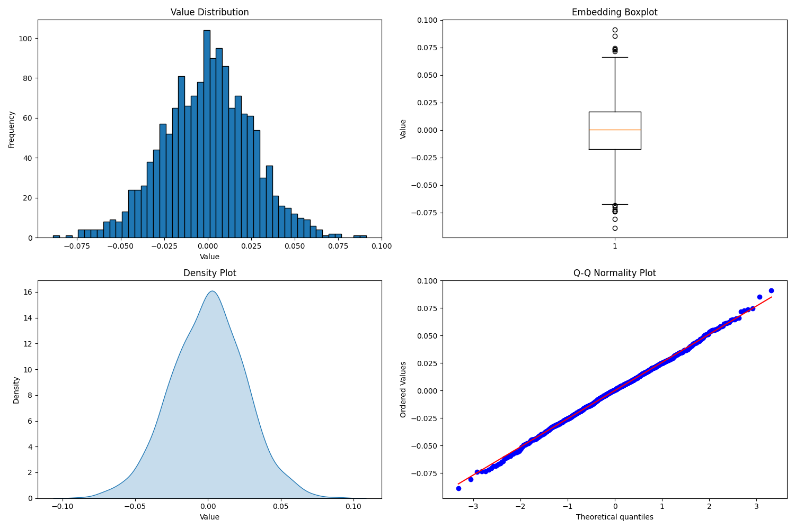

# Statistical Analysis Tool for Embedding Vectors

This Python-based tool performs comprehensive statistical analysis on embedding vectors, generating detailed metrics and visualizations. It provides data scientists and machine learning engineers with insights into the distribution and characteristics of high-dimensional embedding data through statistical measures and visual representations.

The tool calculates a wide range of statistical metrics including basic descriptive statistics, distribution measures, and advanced statistical properties. It automatically generates four different visualization types (histogram, boxplot, density plot, and Q-Q plot) to provide a complete picture of the embedding data distribution. All results are exported to both CSV format and visualization plots for further analysis and documentation.

## Repository Structure
```
.
├── statistic-embedding.py    # Main script containing statistical analysis logic and visualization code
├── requirements.txt          # Python package dependencies
└── .gitignore               # Git configuration file for ignoring virtual environment
```

## Usage Instructions
### Prerequisites
- Python 3.6 or higher
- pip package manager

Required Python packages:
- numpy
- matplotlib
- seaborn
- pandas
- scikit-learn
- scipy

### Installation

1. Clone the repository:
```bash
git clone <repository-url>
cd <repository-name>
```

2. Create and activate a virtual environment:
```bash
# On MacOS/Linux
python3 -m venv .venv
source .venv/bin/activate

# On Windows
python -m venv .venv
.venv\Scripts\activate
```

3. Install dependencies:
```bash
pip install -r requirements.txt
```

### Quick Start
1. Place your embedding file (in .npy format) in the project directory
2. Run the analysis script:
```bash
python estatistic-embedding.py
```
3. The script will generate:
   - A CSV file with statistical metrics
   - A PNG file containing visualization plots

### More Detailed Examples
```python
# Load and analyze custom embedding
import numpy as np
from estatistic-embedding import analyze_embedding

# Load your embedding
my_embedding = np.load('your_embedding.npy')

# Run analysis
results = analyze_embedding(my_embedding)

# Access specific metrics
print(f"Mean value: {results['Média']}")
print(f"Standard deviation: {results['Desvio Padrão']}")
```

### Troubleshooting
Common issues and solutions:

1. **FileNotFoundError when loading embedding**
   - Error: `FileNotFoundError: [Errno 2] No such file or directory`
   - Solution: Ensure your .npy file is in the same directory as the script
   - Debug: Print working directory with `import os; print(os.getcwd())`

2. **Memory Issues with Large Embeddings**
   - Error: `MemoryError`
   - Solution: 
     ```python
     import numpy as np
     np.load('embedding.npy', mmap_mode='r')  # Load in read-only memory-map mode
     ```

3. **Visualization Issues**
   - Error: `RuntimeError: Invalid DISPLAY variable`
   - Solution: Add the following before plotting:
     ```python
     import matplotlib
     matplotlib.use('Agg')  # Use non-interactive backend
     ```

## Data Flow
The tool processes embedding data through a pipeline of statistical analysis and visualization generation. It transforms raw embedding vectors into meaningful statistical metrics and visual representations.

```
[Input .npy file] -> [Statistical Analysis] -> [Visualization Generation]
                                          \-> [CSV Export]
```

Key component interactions:
1. Data Loading: Reads numpy array from .npy file
2. Statistical Processing: Calculates 20+ statistical metrics
3. Visualization Generation: Creates 4 different plot types
4. Export: Saves results to CSV and PNG files
5. Memory Management: Processes data in-memory with numpy operations
6. Error Handling: Validates input data and handles computational edge cases
7. Output Generation: Produces both human-readable and machine-readable outputs

## Visualization Output


The visualization output consists of four plots:
1. **Histogram**: Shows the frequency distribution of embedding values
2. **Boxplot**: Displays the five-number summary (minimum, Q1, median, Q3, maximum) and potential outliers
3. **Density Plot**: Illustrates the probability density of the embedding values
4. **Q-Q Plot**: Assesses the normality of the distribution by comparing against theoretical quantiles

## Statistical Metrics
The tool calculates the following statistical metrics:

1. **Basic Statistics**
   - Dimensões (Dimensions): Total number of elements in the embedding
   - Média (Mean): Average value of all elements
   - Mediana (Median): Middle value when sorted
   - Mínimo (Minimum): Smallest value
   - Máximo (Maximum): Largest value

2. **Dispersion Measures**
   - Desvio Padrão (Standard Deviation): Measure of data spread
   - Variância (Variance): Square of standard deviation
   - IQR (Interquartile Range): Difference between Q3 and Q1
   - Amplitude (Range): Difference between maximum and minimum values

3. **Distribution Characteristics**
   - Assimetria (Skewness): Measure of distribution asymmetry
   - Curtose (Kurtosis): Measure of distribution "tailedness"
   - Q1/Q3: First and third quartiles
   - Entropia (Entropy): Measure of randomness in the distribution

4. **Quantity Metrics**
   - Quantidade de Zeros: Number of zero values
   - Quantidade de Números: Count of finite numbers
   - Soma (Sum): Total sum of all values
   - Soma Quadrática (Squared Sum): Sum of squared values
   - Soma Absoluta (Absolute Sum): Sum of absolute values
   - Soma Absoluta Quadrática (Squared Absolute Sum): Sum of squared absolute values

5. **Normality Test**
   - Shapiro-Wilk p-value: Statistical test for normality (p < 0.05 indicates non-normal distribution)